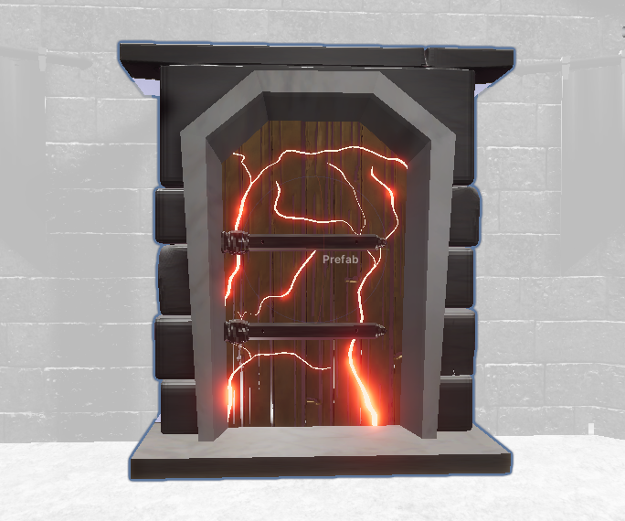
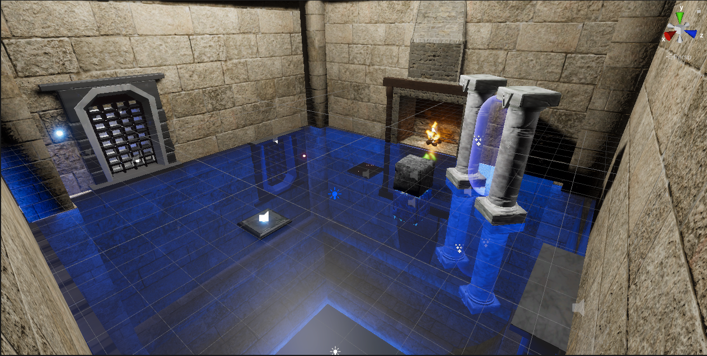

# 3D First-Person Logic Game in Unity

A modular 3D first-person logic puzzle game created as my **Bachelor’s Thesis** at Czech Technical University in Prague. The game combines immersive gameplay, custom-built 3D assets, and Unity’s HDRP pipeline to create an engaging problem-solving experience.

> 📄 Full Thesis: [Download PDF](https://dspace.cvut.cz/bitstream/handle/10467/94656/F3-BP-2021-Veverkova-Lucie-Bachelor_thesis_veverlu4.pdf?sequence=-1&isAllowed=y)

---

## Game Description

This logic game places players in a stylized fantasy world, challenging them with environmental puzzles that require critical thinking and exploration. Players must:

- **Navigate** through complex modular levels
- **Solve logic puzzles** using physical interactions
- **Unlock new areas** by manipulating the environment

Inspired by games like *Portal* and *The Talos Principle*, this project emphasizes thoughtful interaction design and level flow.

---

## Modular Design

All levels are constructed from modular components created in **Blender** and imported into Unity. This approach enabled:

- Rapid iteration of level layout
- Consistent visual language
- Easy expansion for future levels


---

## ✨ Key Features

- Built using **Unity HDRP**
- First-person controller with custom input handling
- Puzzle interaction system with raycasting & trigger zones
- Blender-modeled modular environments
- User testing and feedback loops

---

## Screenshots

| Door Prefab | Puzzle Room |
|----------|-------------|
|  |  |

> You can find more in the `/images` folder.

---

## Example: Puzzle Activation Script

Here’s a key C# script that handles puzzle activation logic when the player interacts with trigger zones.

```csharp
public class PuzzleActivator : MonoBehaviour
{
    public GameObject puzzleObject;

    private void OnTriggerEnter(Collider other)
    {
        if (other.CompareTag("Player"))
        {
            puzzleObject.SetActive(true);
            Debug.Log("Puzzle activated!");
        }
    }
}


### Explanation

**Purpose**: This script is attached to invisible trigger colliders in the environment.

**How it works**: When the player walks into the collider, it activates a specific puzzle object (like a moving platform or door).

**Why it’s modular**: This logic can be reused across multiple puzzles, just by linking a different `GameObject`.

---

### How to Run the Project

1. **Clone the repository**:

   ```bash
   git clone https://github.com/sciurusl/3D-logic-game-in-Unity.git

2. **Open in Unity Hub**:
   - Target version: `Unity 2020.3.18f1` (or any compatible version with HDRP)
   - Open the root folder via Unity Hub

3. **Play the game**:
   - Press ▶️ (Play) in the Unity Editor

---

### Thesis Summary

This game was developed as part of my Bachelor's thesis and covers:

- Custom asset pipeline from **Blender to Unity**
- Logic puzzle interaction design and modular system
- Usability testing conducted with **7 users**
- Iterative design improvements based on feedback

📄 [Read the full thesis (PDF)](https://dspace.cvut.cz/bitstream/handle/10467/94656/F3-BP-2021-Veverkova-Lucie-Bachelor_thesis_veverlu4.pdf?sequence=-1&isAllowed=y)

---

### Project Structure

```plaintext
3D-logic-game-in-Unity/
│
├── Assets/
│   ├── Scripts/         # C# scripts (player movement, puzzles, UI)
│   ├── Models/          # Blender-imported 3D models
│   ├── Materials/       # Shaders and textures
│   └── Scenes/          # Game scenes (.unity files)
│
├── Images/              # Screenshots for documentation
├── README.md            # This file
└── ...

## About Me

**Lucie Veverková**  
🎓 Czech Technical University in Prague  
📧 veverkova.lucie1@gmail.com  
🔗 [LinkedIn](https://linkedin.com/in/yourprofile)

---

## Acknowledgments

- **Supervisor**: Ing. Ladislav Čmolík, Ph.D.  
- **Faculty**: Czech Technical University, Faculty of Electrical Engineering  
- **Inspirations**: *Portal*, *The Talos Principle*, *Lara Croft Go*
